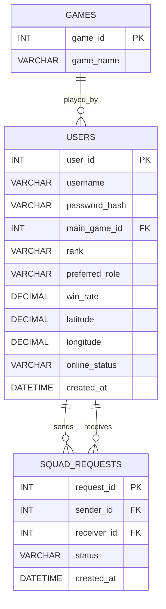

# GG Finder MVP - Database Design

## 1. Database Overview

The GG Finder database stores information about gamers, games, and squad requests.

The main entities are:

1. Users
2. Games
3. Squad Requests

## 2. Entity Relationship Diagram

## 3. Users Table

The `users` table stores information about each gamer.

| Field | Data Type | Key | Description |
|---|---|---|---|
| user_id | INT | PK | Unique user ID |
| username | VARCHAR(50) | UNIQUE | Gamer's username |
| password_hash | VARCHAR(255) | | Hashed password |
| main_game_id | INT | FK | User's main game |
| rank | VARCHAR(50) | | Gamer's rank/skill level |
| preferred_role | VARCHAR(100) | | Preferred role or character |
| win_rate | DECIMAL(5,2) | | Optional win rate |
| latitude | DECIMAL(10,7) | | Approximate latitude |
| longitude | DECIMAL(10,7) | | Approximate longitude |
| online_status | VARCHAR(20) | | Available or Busy |
| created_at | DATETIME | | Account creation date |

### Online Status Values

- `Available`
- `Busy`

## 4. Games Table

The `games` table stores the games supported by GG Finder.

| Field | Data Type | Key | Description |
|---|---|---|---|
| game_id | INT | PK | Unique game ID |
| game_name | VARCHAR(100) | UNIQUE | Name of the game |

Example games:

- Valorant
- League of Legends
- Mobile Legends
- PUBG
- Fortnite

## 5. Squad Requests Table

The `squad_requests` table stores requests sent between gamers.

| Field | Data Type | Key | Description |
|---|---|---|---|
| request_id | INT | PK | Unique request ID |
| sender_id | INT | FK | User sending the request |
| receiver_id | INT | FK | User receiving the request |
| status | VARCHAR(20) | | Pending, Accepted, or Rejected |
| created_at | DATETIME | | Date/time request was created |

### Request Status Values

- `Pending`
- `Accepted`
- `Rejected`

## 6. Relationships

### Games to Users

One game can be the main game for many users.

**Relationship: 1-to-Many**

`GAMES.game_id` → `USERS.main_game_id`

### Users to Squad Requests

One user can send many squad requests.

One user can also receive many squad requests.

**Relationship: 1-to-Many**

`USERS.user_id` → `SQUAD_REQUESTS.sender_id`

`USERS.user_id` → `SQUAD_REQUESTS.receiver_id`

## 7. Example Data

### Users

| user_id | username | main_game_id | rank | preferred_role | win_rate | latitude | longitude | online_status |
|---|---|---:|---|---|---:|---:|---:|---|
| 1 | PlayerOne | 1 | Diamond | Duelist | 58.50 | 13.7563 | 100.5018 | Available |
| 2 | GamerX | 1 | Platinum | Controller | 52.30 | 13.7500 | 100.5100 | Busy |
| 3 | Shadow | 2 | Crown | Assault | 61.20 | 13.7600 | 100.4950 | Available |

### Games

| game_id | game_name |
|---:|---|
| 1 | Valorant |
| 2 | PUBG |

### Squad Requests

| request_id | sender_id | receiver_id | status | created_at |
|---:|---:|---:|---|---|
| 1 | 1 | 3 | Pending | 2026-09-04 18:00:00 |
| 2 | 2 | 1 | Accepted | 2026-09-04 18:30:00 |

## 8. Database Rules

- `user_id`, `game_id`, and `request_id` must be unique.
- A username must be unique.
- A squad request must have a valid sender and receiver.
- A user cannot send a squad request to themselves.
- `online_status` should only contain `Available` or `Busy`.
- `status` should only contain `Pending`, `Accepted`, or `Rejected`.
- `win_rate` is optional.
- Location is stored using latitude and longitude to support the 5 km nearby search.
